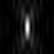

# simple_sim_fusion_demo
Simple demo of structured illumination microscopy image fusion via Richardson-Lucy deconvolution

Given a 2D x-z object:

Illuminated with a series of 2D x-z intensity patterns like this:

And blurred with a 2D x-z PSF like this:

