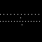
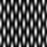

# simple_sim_fusion_demo
Simple demo of structured illumination microscopy image fusion via Richardson-Lucy deconvolution

Given a true object:

Illuminated with a series of intensity patterns like this:

